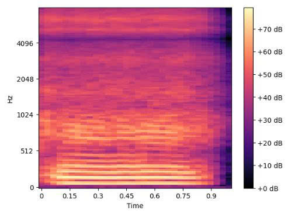
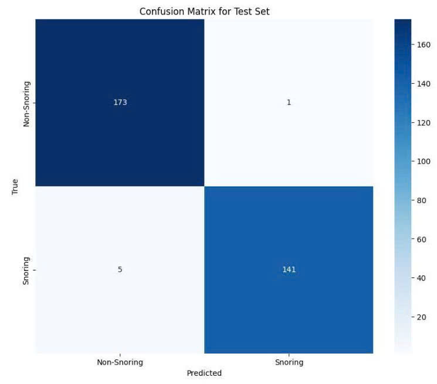

# 💤 Snore Guard - A Snoring detection integrated product with Tiny Machine Learning

A real-time snoring detection system using TinyML, optimized to run on microcontrollers (ESP32-S3). This project aims to support the detection of sleep apnea and other sleep-related health issues.
------------------
## 🎯 Project Goals

- Detect snoring sounds from microphone input  
- Classify "Snoring" and "Non-Snoring" using a lightweight ML model  
- Deploy the model directly on embedded devices (ESP32-S3)  
- Display results and trigger alerts in real time  
-------------------
## 📦 Technologies & Hardware Used

| Component         | Description                                     |
|-------------------|-------------------------------------------------|
| `ESP32-S3 N8R8`   | Main microcontroller with AI acceleration       |
| `MAX9814`         | AGC analog microphone for clean audio capture   |
| `Python`          | For data processing and model training          |
| `TensorFlow Lite` | Convert model for embedded deployment           |
|    `ESP-IDF`      | Programming and integration on ESP32            |

--------------
## 🧠 Model & Dataset

- Two audio classes: `snoring` and `non-snoring`
- Feature extraction: **Log-Mel Spectrograms**
- Lightweight CNN model (158,468 parameters ~ 619 KB in size)
- Accuracy: **> 90%**
- Optimized with TensorFlow Lite for Microcontrollers

---
## 🚀 Installation & Run inference (on PC)

```bash
cd python
pip install -r requirements.txt
python inference_model.py
```
---
## Key technology:
Using log-mel spectrogram to convert audio to image format in order to machine learning can extract the features of snoring

:--:
*The log-mel spectrogram visualizer*  


*The model evaluation result* 
---
## Deploy to ESP32

To deploy tflite model onto ESP32-S3, please follow the bellow instruction
(https://www.espressif.com/en/products/hardware/esp32/overview) or (https://github.com/espressif/esp-idf).

Connect the microphone pin folowing: the SCK to pin 41, WS to pin 13 and SD to pin 47.

### Building using ESP-IDF
```
cd main
idf.py build
idf.py -p /dev/ttyACM0 flash monitor
```

### Sample output

  * When a keyword is detected you will see following output sample output on the log screen:

```
Heard snoring (<score>) at <time>
```
The score varies from 0 to 255, with 128 being the detection threshold and 255 indicating 100% confidence.
