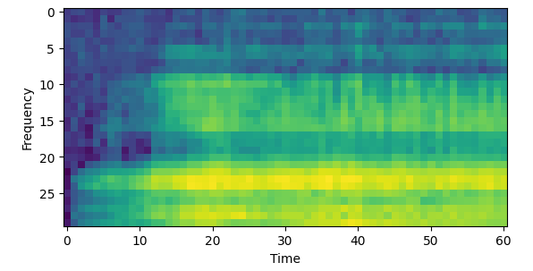
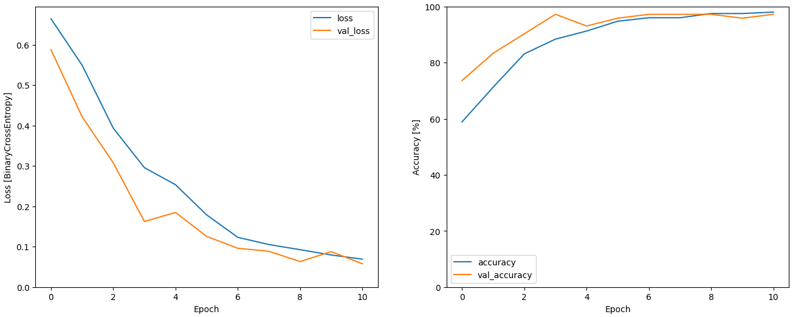

# Modified micro speech
*Demonstration video:* https://youtu.be/M0j5muW0jOc

This is the code for the modified version of the micro speech example code from Tensorflow lite. When uploaded to an ESP32 connnected to an 
INMP441 microphone, it allows the microcontroller to recognize snoring sounds by continually listening to its surroundings and indicating
when it has detected snoring on the TTY terminal.

The model is 168 KB in size, and its inputs are spectrograms on the logarithmic and mel scale. The model is approximately run twice a second,
and has an accuracy of 95% on the test data.


:--:
*Example of a snoring audio sample's log mel spectrogram fed to the model* 

The datasets of audio samples used for training are made up of 500 snoring sounds, 500 non-snoring sounds, sourced from this work:
T. H. Khan, "A deep learning model for snoring detection and vibration notification using a smart wearable gadget," Electronics,
vol. 8, no. 9, article. 987, ISSN 2079-9292, 2019.

The main files modified from the micro speech example by Tensorflow are in main/, and they are : audio_provider.cc, feature_provider.cc,
recognize_commands.cc, and of course model.cc.


:--:
*The model training result* 

## Deploy to ESP32

The following instructions will help you build and deploy this sample
to [ESP32](https://www.espressif.com/en/products/hardware/esp32/overview)
devices using the [ESP IDF](https://github.com/espressif/esp-idf).

Connect the SCK to pin 32, WS to pin 25 and SD to pin 33.

### Building the example

Set the chip target (IDF version `release/v5.0` is needed):

```
idf.py set-target esp32
```

Then build with `idf.py`
```
idf.py build
```

### Load and run the example

To flash (replace `/dev/ttyUSB0` with the device serial port):
```
idf.py --port /dev/ttyUSB0 flash
```

Monitor the serial output:
```
idf.py --port /dev/ttyUSB0 monitor
```

Use `Ctrl+]` to exit.

The previous two commands can be combined:
```
idf.py --port /dev/ttyUSB0 flash monitor
```

### Sample output

  * When a keyword is detected you will see following output sample output on the log screen:

```
Heard snoring (<score>) at <time>
```
The score varies from 0 to 255, with 128 being the detection threshold and 255 indicating 100% confidence.
